# Design Document: Unified Enterprise Management System (UEMS)

**Version:** 2.0
**Date:** 
**Author:** 
**Status:** Proposed

## Executive Summary

This document presents the comprehensive technical design for a unified enterprise management system that consolidates three disparate legacy systems: a Java-based Orders Management System, an Excel-based Contract Management System, and a PHP/iTop-based Ticket Management System. The proposed solution addresses critical business challenges including data silos, manual integration processes, and operational inefficiencies through a modern, scalable microservices architecture.

**Key Business Drivers:**
- Eliminate data duplication and inconsistencies across Customer/Organization entities.
- Automate supplier validation during order processing.
- Provide a unified customer service experience linking orders, contracts, and support tickets.
- Enable real-time business intelligence and reporting across all operational domains.

**Solution Overview:**
The unified system implements an event-driven microservices architecture with centralized master data management, eliminating current manual integration challenges while providing enhanced workflow automation and business intelligence capabilities. This approach will deliver significant improvements in efficiency, data quality, scalability, and user experience, positioning the organization for future growth and agility.

---

## 1. Introduction

### 1.1. Purpose
This document specifies the architectural and functional design for the Unified Enterprise Management System (UEMS). The UEMS is envisioned as a next-generation platform that consolidates and modernizes the capabilities of three existing legacy systems: Orders Management, Contract Management, and Ticket Management. The primary objective is to create a cohesive, efficient, and scalable solution that addresses current operational inefficiencies, data silos, and integration complexities.

### 1.2. Scope
The scope of the UEMS encompasses the end-to-end lifecycle management for:
*   **Supplier and Contract Operations:** Including supplier onboarding, comprehensive profile management, contract authoring, negotiation, approval workflows, terms and compliance tracking, and lifecycle events (renewals, expirations, terminations).
*   **Order Fulfillment:** Covering robust product catalog management, customer account administration, order creation and processing, real-time status tracking, and basic delivery coordination.
*   **Customer Service and Ticket Management:** Including multi-channel ticket intake, intelligent categorization and prioritization, rule-based assignment and escalation, comprehensive resolution workflows, and seamless integration with order and customer data.

This document details the system architecture, component interactions, data flows, data models, user experience paradigms, migration strategies, and operational considerations.

### 1.3. Objectives and Business Benefits
The UEMS aims to achieve the following key objectives:
*   **Unify Operations:** Provide a single, integrated platform for managing core business processes.
*   **Enhance Efficiency:** Streamline workflows and automate manual tasks to reduce operational overhead.
*   **Improve Data Integrity:** Establish Master Data Management (MDM) for key entities (Customers, Suppliers) to eliminate duplication and inconsistencies.
*   **Increase Visibility:** Offer comprehensive, real-time insights into operational performance through integrated reporting and analytics.
*   **Boost Agility:** Enable faster adaptation to changing business needs through a modular and extensible architecture.
*   **Elevate User Experience:** Provide an intuitive, modern, and role-based user interface.
*   **Reduce Technical Debt:** Replace aging legacy systems with a maintainable and scalable technology stack.

These objectives will translate into tangible business benefits such as reduced operational costs, improved customer satisfaction, better supplier relationships, enhanced compliance, and more informed strategic decision-making.

## 2. Current State Analysis

### 2.1. Legacy System Assessment

The current operational landscape is fragmented across three distinct legacy systems, each with its own technology stack, data model, and business logic. The following diagram and descriptions outline the challenges born from this separation.

Here is the cross system integration flow:


#### 2.1.1. Orders Management System (Java-based)
*   **Architecture:** Java Servlet-based web application with MariaDB backend.
*   **Core Capabilities:** Customer lifecycle management, product catalog with variants, and a multi-stage order processing workflow (incoming → approved → shipped → payment_debts/completed).
*   **Data Model Complexity:** 20+ core entities, including advanced product variant management and geographical delivery tracking.
*   **Technical Limitations:** A dated JSP-based UI limits user experience, while a tightly coupled architecture impedes extensibility and scalability.

#### 2.1.2. Contract Management System (Excel-based)
*   **Architecture:** An Excel template-driven system with a relational database backend.
*   **Core Capabilities:** Comprehensive supplier onboarding, multi-level contract approval workflows, RFQ management, and full contract lifecycle tracking.
*   **Business Process Maturity:** Features advanced supplier qualification processes, performance metric tracking, and automated renewal notifications.
*   **Operational Constraints:** Heavy reliance on manual data entry introduces consistency risks, and the workflow engine lacks flexibility for complex approval scenarios.

#### 2.1.3. Ticket Management System (iTop-based)
*   **Architecture:** PHP-based iTop framework with comprehensive ITSM capabilities.
*   **Core Capabilities:** Sophisticated ticket lifecycle management (UserRequest & Incident), advanced rule-based assignment logic, SLA management with automated escalations, and CMDB integration.
*   **Workflow Sophistication:** Well-defined state models for user requests and incidents, including parent-child ticket relationships for complex issue tracking.
*   **Integration Architecture:** Supports REST APIs for external connectivity but is not fully leveraged in the current ecosystem.

### 2.2. Integration Challenges Assessment

#### 2.2.1. Data Synchronization Issues
*   **Customer/Organization Entity Duplication:** The Orders System's `Customer` entity and the Tickets System's `Organization` entity are not synchronized, leading to data drift and inconsistencies.
*   **Supplier Information Fragmentation:** Basic supplier data in the Orders System is manually reconciled with the comprehensive profiles in the Contracts System, creating accuracy and efficiency risks.

#### 2.2.2. Business Process Disconnects
*   **Order-Contract Validation Gap:** Order creation lacks automated supplier contract validation, leading to manual verification, processing delays, and the risk of engaging with non-compliant or expired contracts.
*   **Support Ticket Context Limitations:** Support agents lack an automated, unified view of a customer's orders and contracts when a ticket is created, leading to inefficient issue resolution.

#### 2.2.3. Technical Integration Constraints
*   **Data Format Inconsistencies:** Multiple date formats, inconsistent identifier schemes, and varying status enumerations across systems require manual mapping and transformation.
*   **Manual Integration:** The primary integration method is manual export/import, with no real-time data exchange, centralized monitoring, or error handling.

## 3. User Personas and Stakeholder Analysis

Understanding the diverse user base is critical for designing an effective unified system. The following personas represent key stakeholders who will be primary users of the new platform.

### 3.1. Procurement and Supplier Management

#### 3.1.1. Persona: The Procurement Manager
*   **Role:** Senior Procurement Manager responsible for strategic supplier relationships, contract negotiations, compliance, and cost optimization.
*   **Goals:** Maintain comprehensive supplier scorecards, ensure 100% contract compliance, achieve cost savings, and reduce supplier onboarding time.
*   **Pain Points:** Supplier information is scattered, manual correlation of performance data is required, and there is a lack of real-time visibility and automated alerts for contract events.
*   **Success Metrics:** A 60% reduction in contract processing time, a supplier compliance score over 95%, and real-time visibility into supplier performance.
> *"I need a single source of truth for all our supplier and contract information, with real-time performance data and automated workflows, so we can make smarter, faster decisions and proactively manage risks."*

#### 3.1.2. Workflow Journey: Procurement Manager


### 3.2. Order Fulfillment

#### 3.2.1. Persona: The Order Processor / Dispatch Coordinator
*   **Role:** Order Processing Specialist responsible for daily order processing, inventory allocation, and shipping coordination.
*   **Goals:** Process orders with 99.9% accuracy, maintain real-time inventory visibility, coordinate efficient delivery, and provide proactive customer communication.
*   **Pain Points:** Manual data entry across multiple systems, lack of real-time inventory data, time-consuming supplier coordination, and manual customer updates.
*   **Success Metrics:** 50% reduction in order processing time, automated notifications for 90% of order events, and zero manual data entry for standard orders.
> *"I need streamlined workflows that automatically handle routine tasks and give me clear action items for exceptions, so I can focus on delivering excellent customer service rather than managing system complexity."*

#### 3.2.2. Workflow Journey: Order Processor


### 3.3. Customer Service and Support

#### 3.3.1. Persona: The Customer Support Manager
*   **Role:** Leads a team of 15 support agents and is responsible for support KPIs like response time, resolution rate, and CSAT scores.
*   **Goals:** Achieve 95% CSAT, maintain a <2 hour response time, implement self-service to reduce ticket volume, and provide agents with complete customer context.
*   **Pain Points:** Agents must access multiple systems for context, issues are manually correlated with orders, and there is limited automation for routine communications.
*   **Success Metrics:** A single-screen customer view, automated routing for 80% of tickets, and proactive issue identification.
> *"My team needs instant access to complete customer context and automated workflows that handle routine tasks, so we can focus on solving complex problems and building lasting customer relationships."*

#### 3.3.2. Persona: The Support Agent
*   **Role:** Customer Support Specialist handling 50+ daily interactions, specializing in order-related inquiries.
*   **Goals:** Resolve 85% of issues on first contact, maintain high CSAT, reduce case resolution time, and provide proactive customer education.
*   **Pain Points:** Switching between systems disrupts workflow, incomplete history makes diagnosis difficult, and manual research is needed for supplier-related delays.
*   **Success Metrics:** Intuitive interface with quick navigation and automated status updates.

### 3.4. IT and System Administration

#### 3.4.1. Persona: The System Administrator
*   **Role:** Senior System Administrator managing infrastructure, integration, data, and security.
*   **Goals:** Achieve 99.9% uptime, implement comprehensive security controls, enable a scalable architecture, and provide self-service IT capabilities.
*   **Pain Points:** Complex integration maintenance, manual user provisioning, limited business process monitoring, and time-consuming BCDR procedures.
*   **Success Metrics:** 60% reduction in operational complexity, automated user lifecycle management, and comprehensive monitoring with predictive maintenance.
> *"I need a unified platform that's easier to manage, more secure, and more reliable than our current system sprawl, with comprehensive automation that reduces manual operational overhead."*

## 4. System Architecture

The UEMS will be architected as a distributed system based on microservices principles and an event-driven paradigm. This approach promotes modularity, scalability, resilience, and independent deployability of components.

### 4.1. Architectural Style
*   **Microservices:** Core business domains (Accounts, Products, Orders, Contracts, Tickets) will be encapsulated within distinct, independently deployable services. This allows for technology diversity, focused development teams, and granular scaling.
*   **Event-Driven Architecture (EDA):** Services will communicate asynchronously via an enterprise event bus. This decouples services, enhances resilience to transient failures, and enables reactive workflows and real-time data propagation.
*   **API-First Design:** All services will expose well-defined, versioned APIs (primarily RESTful) for internal and potential external consumption, facilitated by an API Gateway.

### 4.2. High-Level Architecture Diagram (C4 Level 1 Context Diagram)


### 4.3. Logical Architecture (Container Diagram - Key Services)


### 4.4. Component Descriptions
*   **User Interfaces (Web/Mobile):** Provide role-based access to UEMS functionalities through a modern Single Page Application (SPA).
*   **API Gateway:** Acts as the single entry point for all client requests, handling routing, composition, authentication, rate limiting, and caching.
*   **Account Service (MDM):** Manages master data for `Accounts` (Customers, Suppliers), providing a single source of truth and publishing change events.
*   **Product Service:** Manages the global product catalog, including definitions, variants, categories, and pricing strategies.
*   **Order Service:** Orchestrates the entire order lifecycle from creation and validation to fulfillment coordination.
*   **Contract Service:** Manages supplier contracts, RFQs, approvals, terms, compliance, and lifecycle events.
*   **Ticket Service:** Handles the creation, assignment, tracking, and resolution of customer support tickets, with rich contextual integration.
*   **Notification Service:** Manages and dispatches all system-generated notifications (e.g., email, SMS, in-app).
*   **Reporting & Analytics Service:** Aggregates data from various services to provide operational reports, dashboards, and analytical capabilities.
*   **Authentication & Authorization Service:** Manages user identities, credentials, roles, permissions, and token issuance (OAuth 2.0/OIDC).
*   **Enterprise Event Bus:** Facilitates asynchronous, decoupled communication between services using a technology like Apache Kafka.
*   **Unified Database (Polyglot Persistence):** Provides persistent storage using a polyglot strategy, where each service chooses its optimal database (e.g., PostgreSQL for transactions, MongoDB for catalogs).
*   **Centralized Logging & Monitoring Platform:** Aggregates logs, metrics, and traces for real-time monitoring and diagnostics (e.g., ELK Stack, Prometheus/Grafana).

## 5. Component Interaction Specifications

### 5.1. High-Level Service Communication
Interactions employ a hybrid communication model. Synchronous REST API calls via the API Gateway are used for immediate request/response operations, while the asynchronous Event Bus handles decoupled service communication and event sourcing for maintaining state and audit trails.

```mermaid
sequenceDiagram
    participant U as 👤 User
    participant API as 🌉 API Gateway
    participant OS as 📦 Order Service
    participant CS as 📄 Contract Service
    participant TS as 🎫 Ticket Service
    participant EB as 🔄 Event Bus
    participant NS as 🔔 Notification Service
    
    Note over U: 1. User initiates order
    U->>+API: Create Order
    
    Note over API,OS: 2. Process order
    API->>+OS: Process Order
    
    Note over OS,CS: 3. Validate contract
    OS->>+CS: Validate Supplier Contract
    CS-->>-OS: Contract Status
    
    Note over OS,EB: 4. Publish event
    OS->>+EB: Order Created Event
    
    Note over EB,TS: 5. Auto-create ticket (optional)
    EB->>+TS: Auto-create Support Ticket if needed
    
    Note over EB,NS: 6. Notify stakeholders
    EB->>+NS: Send Notifications
    
    Note over OS,API: 7. Confirm order
    OS-->>-API: Order Response
    API-->>-U: Order Confirmation
    
    Note over U: 8. User receives confirmation
```



### 5.2. Scenario: Order Creation with Integrated Validations
*   **Trigger:** User submits a new order via the UI.
*   **Workflow:**
    1.  `UI` sends a `POST /api/v1/orders` request to the `API Gateway`.
    2.  `API Gateway` authenticates the request via `Auth Service` and routes it to the `Order Service`.
    3.  `Order Service` receives the request and performs synchronous validations:
        a.  Calls `Account Service` (`GET /api/v1/accounts/{customerId}`) to validate customer status.
        b.  For each product, calls `Product Service` (`GET /api/v1/products/{productId}`) to verify availability and price.
        c.  For each supplier-linked item, calls `Contract Service` (`GET /api/v1/contracts/validate-supplier?...`) to check for an active, compliant contract.
    4.  **If all validations pass:**
        a.  `Order Service` persists the new `Order` with status "PENDING_CONFIRMATION".
        b.  It returns a `201 Created` response to the UI.
        c.  It publishes an `OrderCreatedEvent` to the `Event Bus`.
    5.  **If any validation fails:** `Order Service` returns an appropriate error (e.g., `400 Bad Request`) to the UI.
    6.  **Asynchronous Follow-up:**
        a.  `Notification Service` consumes the `OrderCreatedEvent` and sends a confirmation email to the customer.
        b.  `Reporting Service` consumes the event to update its analytical data stores.

### 5.3. Scenario: Contract Term Modification and Impact Assessment
*   **Trigger:** An authorized user updates the terms of an active supplier contract.
*   **Workflow:**
    1.  `UI` sends a `PUT /api/v1/contracts/{contractId}` request to the `API Gateway`.
    2.  `API Gateway` authorizes the request and routes it to the `Contract Service`.
    3.  `Contract Service` validates, persists the update, and may trigger an internal approval workflow.
    4.  It publishes a `ContractTermsUpdatedEvent` (with contract ID, supplier ID) to the `Event Bus`.
    5.  **Asynchronous Impact Analysis:**
        a.  `Order Service` consumes the `ContractTermsUpdatedEvent`, identifies active orders with the affected supplier, and re-evaluates them against the new terms.
        b.  For any non-compliant orders, it publishes an `OrderComplianceIssueEvent`.
        c.  `Ticket Service` consumes the `OrderComplianceIssueEvent`, creates a new internal review ticket, and assigns it to the appropriate team.
        d.  `Notification Service` consumes the resulting `TicketCreatedEvent` and notifies the review team.

## 6. Data Flow and Process Documentation

### 6.1. Master Data Flow (e.g., Account Data)
1.  **Origination/Update:** `Account Service` is the master source. Changes occur via UI -> `API Gateway` -> `Account Service`.
2.  **Propagation:** `Account Service` publishes an `AccountUpdatedEvent` to the `Event Bus`.
3.  **Consumption:** Other services (`Order`, `Contract`, `Ticket`) consume this event to update their local, denormalized caches/references. The `Reporting Service` consumes it to update its data warehouse.
4.  **Consistency Model:** Eventual consistency for replicated data. For critical, real-time operations, services can make direct API calls to the `Account Service`.

### 6.2. Key Business Process Flows

#### 6.2.1. Supplier Onboarding & Contract Initiation
This flow outlines the process for internal users to onboard new suppliers and manage contracts through approval workflows.

```mermaid
flowchart TD
    A[📝 Supplier Registration Portal] --> B[🔍 Automated Supplier Validation]
    B --> C[✅ Compliance & Financial Check]
    C --> D{Approved?}
    
    D -->|✅ Yes| E[🟢 Active Supplier in MDM]
    E --> F[📜 Contract Creation in UEMS]
    F --> G[🔄 Digital Contract Approval Workflow]
    G --> H[✅ Active Contract]
    H --> I[🚀 Order Processing Enabled]
    
    D -->|❌ No| J[🟡 Pending Review]
    J --> K[📝 Revision Required]
    K --> B
    
    style A fill:#e1f5fe,stroke:#0288d1
    style E fill:#e8f5e9,stroke:#388e3c
    style H fill:#e8f5e9,stroke:#388e3c
    style J fill:#fff8e1,stroke:#ffa000
```



#### 6.2.2. Order Processing with Integrated Checks
This flow demonstrates automated validation, real-time inventory checks, and automatic exception handling.

```mermaid
flowchart TD
    A[🛒 Customer Places Order via UI] --> B[🔍 Product & Customer Validation]
    B --> C[📜 Automated Supplier Contract Check]
    C --> D{Contract Valid?}
    
    D -->|✅ Yes| E[📦 Real-time Inventory Check]
    E --> F{Stock Available?}
    F -->|✅ Yes| G[✅ Order Approved]
    G --> H[🚚 Order Fulfillment & Shipping]
    H --> I[📦 Delivery Tracking]
    I --> J[✅ Order Complete]
    
    F -->|❌ No| K[⚠️ Backorder Ticket Created]
    K --> L[📧 Customer Stock Notification]
    
    D -->|❌ No| M[❌ Contract Issue Ticket Created]
    M --> N[🔧 Procurement Team Notified]
    
    style A fill:#e1f5fe,stroke:#0288d1
    style G fill:#e8f5e9,stroke:#388e3c
    style J fill:#e8f5e9,stroke:#388e3c
    style K fill:#fff8e1,stroke:#ffa000
    style M fill:#ffebee,stroke:#d32f2f
```



#### 6.2.3. Context-Aware Ticket Resolution
This flow illustrates how tickets are automatically enriched with data from other services.

```mermaid
flowchart TD
    A[🎫 Ticket Creation Email, Portal, Phone] --> B[🏷️ Automatic Categorization & Prioritization]
    B --> C[⏱️ SLA Assignment]
    C --> D[👥 Automated Team & Agent Assignment]
    D --> E[🔗 Auto-link to Order/Contract]
    E --> F[🔍 Agent Investigation with Full Context]
    F --> G{Order Related?}
    
    G -->|✅ Yes| H[📦 Load Order & Contract Context]
    H --> I[🔄 Update Order/Customer Status]
    I --> J[✅ Resolution Applied]
    
    G -->|❌ No| K[🔧 Standard Resolution Workflow]
    K --> J
    
    J --> L[📧 Automated Customer Notification]
    L --> M[✅ Ticket Closed]
    
    style A fill:#e1f5fe,stroke:#0288d1
    style J fill:#e8f5e9,stroke:#388e3c
    style M fill:#e8f5e9,stroke:#388e3c
```



## 7. User Experience (UX) Flow Diagrams

The UX will be role-based, providing tailored dashboards and workflows for different user personas.

### 7.1. Unified Dashboard Access Flow
Users are authenticated and directed to a dashboard tailored to their role, providing quick access to relevant information and actions.


### 7.2. End-to-End Order-to-Ticket Flow (Customer Perspective)
This flow illustrates a seamless customer journey from placing an order to reporting a related issue.


### 7.3. Supplier Onboarding & Contract Initiation Flow (Internal)
This flow outlines the internal process for onboarding suppliers and managing contracts through approval workflows.


## 8. Data Model and Schema Design

### 8.1. Logical Data Model (Key Entities & Attributes)
The unified data model is designed to eliminate redundancy, ensure referential integrity, and provide a holistic view of enterprise data. It consolidates concepts from the three legacy systems into a single source of truth.

*   **`Accounts`**: Central repository for all entities (Customers, Suppliers, Partners). MDM source.
    *   `AccountID` (PK), `AccountUUID` (UK), `AccountName` (NN), `AccountType` (ENUM), `PrimaryContactEmail` (UK), `Status` (ENUM), `TaxIdentifier`, `CreatedAt`, `UpdatedAt`.
*   **`Addresses`**: Reusable address entity.
    *   `AddressID` (PK), `StreetLine1` (NN), `City` (NN), `PostalCode` (NN), `CountryCode` (NN).
*   **`SupplierProfiles`**: Extends `Accounts` for supplier-specific data (compliance, financial stability, etc.).
    *   `SupplierProfileID` (PK), `AccountID` (FK, UK), `ComplianceStatus` (ENUM), `FinancialStabilityScore`.
*   **`Products`**: Master catalog of goods/services.
    *   `ProductID` (PK), `ProductCode` (SKU, UK), `ProductName` (NN), `Description`, `BasePrice` (NN), `IsEnabled`.
*   **`Orders`**: Represents a customer's request.
    *   `OrderID` (PK), `OrderNumber` (UK), `CustomerAccountID` (FK, NN), `OrderStatus` (ENUM), `OrderDate` (NN), `TotalAmount` (NN), `ShippingAddressID` (FK), `BillingAddressID` (FK).
*   **`OrderItems`**: Line items within an order.
    *   `OrderItemID` (PK), `OrderID` (FK), `ProductID` (FK), `Quantity` (NN), `UnitPrice` (NN).
*   **`Contracts`**: Legally binding agreements.
    *   `ContractID` (PK), `ContractNumber` (UK), `SupplierAccountID` (FK, NN), `ContractTitle` (NN), `Status` (ENUM), `EffectiveDate` (NN), `ExpirationDate` (NN).
*   **`Tickets`**: Tracks customer issues, requests, or incidents.
    *   `TicketID` (PK), `TicketNumber` (UK), `Title` (NN), `Status` (ENUM), `Priority` (ENUM), `RequesterAccountID` (FK, NN), `RelatedOrderID` (FK), `RelatedContractID` (FK), `AssignedToUserID` (FK).
*   **`Users`**: Internal system users.
    *   `UserID` (PK), `Username` (UK), `Email` (UK), `FullName` (NN), `IsEnabled`.

*(Additional junction and lookup tables like `ProductVariants`, `ContractLineItems`, `Roles`, and `Teams` will exist to support many-to-many relationships and standardized enumerations.)*

### 8.2. Entity Relationship Diagram (ERD)
This ERD depicts the core entities and their primary relationships within the UEMS.


### 8.3. Database Schema Design (Illustrative DDL)
This DDL provides a more detailed view of key tables, including indexing and constraint considerations.

```sql
-- Accounts (Primary Entity for Customers, Suppliers, etc.)
CREATE TABLE Accounts (
    AccountID INT PRIMARY KEY AUTO_INCREMENT,
    AccountUUID UUID UNIQUE NOT NULL DEFAULT gen_random_uuid(),
    AccountName VARCHAR(255) NOT NULL,
    AccountType VARCHAR(50) NOT NULL CHECK (AccountType IN ('CUSTOMER', 'SUPPLIER', 'PARTNER')),
    Status VARCHAR(50) NOT NULL DEFAULT 'PENDING_VALIDATION',
    CreatedAt TIMESTAMP WITH TIME ZONE DEFAULT CURRENT_TIMESTAMP,
    UpdatedAt TIMESTAMP WITH TIME ZONE DEFAULT CURRENT_TIMESTAMP,
    INDEX idx_accounts_name (AccountName),
    INDEX idx_accounts_type (AccountType)
);

-- Enhanced Supplier Entity (Master Data)  
CREATE TABLE SupplierProfiles (
    SupplierProfileID INT PRIMARY KEY AUTO_INCREMENT,
    AccountID INT NOT NULL UNIQUE,
    ComplianceStatus VARCHAR(50) NOT NULL DEFAULT 'PENDING_REVIEW',
    FinancialInfo JSONB,
    PerformanceMetrics JSONB,
    CreatedAt TIMESTAMP WITH TIME ZONE DEFAULT CURRENT_TIMESTAMP,
    UpdatedAt TIMESTAMP WITH TIME ZONE DEFAULT CURRENT_TIMESTAMP,
    FOREIGN KEY (AccountID) REFERENCES Accounts(AccountID) ON DELETE CASCADE,
    INDEX idx_supplierprofiles_compliance (ComplianceStatus)
);

-- Enhanced Order Entity
CREATE TABLE Orders (
    OrderID INT PRIMARY KEY AUTO_INCREMENT,
    OrderNumber VARCHAR(50) UNIQUE NOT NULL,
    CustomerAccountID INT NOT NULL,
    OrderStatus VARCHAR(50) NOT NULL DEFAULT 'INCOMING',
    TotalAmount DECIMAL(14, 2) NOT NULL,
    OrderDate TIMESTAMP WITH TIME ZONE NOT NULL DEFAULT CURRENT_TIMESTAMP,
    CreatedAt TIMESTAMP WITH TIME ZONE DEFAULT CURRENT_TIMESTAMP,
    UpdatedAt TIMESTAMP WITH TIME ZONE DEFAULT CURRENT_TIMESTAMP,
    FOREIGN KEY (CustomerAccountID) REFERENCES Accounts(AccountID) ON DELETE RESTRICT,
    INDEX idx_orders_customer (CustomerAccountID),
    INDEX idx_orders_status (OrderStatus)
);

-- Enhanced Ticket Entity
CREATE TABLE Tickets (
    TicketID INT PRIMARY KEY AUTO_INCREMENT,
    TicketNumber VARCHAR(50) UNIQUE NOT NULL,
    Title VARCHAR(255) NOT NULL,
    Description TEXT,
    RequesterAccountID INT NOT NULL,
    RelatedOrderID INT,
    RelatedContractID INT,
    Priority VARCHAR(20) DEFAULT 'MEDIUM',
    Status VARCHAR(50) DEFAULT 'NEW',
    CreatedAt TIMESTAMP WITH TIME ZONE DEFAULT CURRENT_TIMESTAMP,
    UpdatedAt TIMESTAMP WITH TIME ZONE DEFAULT CURRENT_TIMESTAMP,
    FOREIGN KEY (RequesterAccountID) REFERENCES Accounts(AccountID) ON DELETE RESTRICT,
    FOREIGN KEY (RelatedOrderID) REFERENCES Orders(OrderID) ON DELETE SET NULL,
    -- FOREIGN KEY (RelatedContractID) REFERENCES Contracts(ContractID) ON DELETE SET NULL,
    INDEX idx_tickets_requester (RequesterAccountID),
    INDEX idx_tickets_status (Status)
);
```

## 9. Migration Considerations

Transitioning from three disparate legacy systems to a unified platform requires a meticulous, phased migration strategy.

### 9.1. Phased Approach
The migration will be executed in phases to minimize disruption and risk:
1.  **Phase 0: Discovery & Foundational Setup:** Detailed analysis of legacy systems, data mapping, and deployment of the core infrastructure, `Account Service` (MDM), and authentication.
2.  **Phase 1: Master Data Consolidation:** Migrate, cleanse, and consolidate all customer and supplier data from legacy systems into the `Account Service`, establishing it as the single source of truth.
3.  **Phase 2: Contract Management Go-Live:** Implement and roll out the `Contract Service` and its associated workflows. Decommission the Excel-based system.
4.  **Phase 3: Order Management Go-Live:** Implement and roll out the `Order Service`, ensuring it integrates with the live `Contract Service` for validation. Develop data synchronization shims to coexist with the legacy Orders system if a hard cutover is not feasible.
5.  **Phase 4: Ticket Management Go-Live & Full Unification:** Roll out the `Ticket Service` with full context from the live Order and Contract services. Decommission the final legacy systems.
6.  **Phase 5: Optimization & Extension:** Focus on performance tuning, advanced feature development (analytics, AI), and continuous improvement.

### 9.2. Data Migration Strategy
*   **Assessment & Cleansing:** Thoroughly analyze data quality in each legacy system. Define and apply cleansing rules for deduplication, standardization, and validation.
*   **Mapping & Transformation:** Define precise field-level mappings from legacy schemas to the UEMS model. Account for transformations in data types and formats.
*   **Tooling:** Utilize ETL tools (e.g., Apache NiFi, Talend) for data extraction, transformation, and loading into a staging database.
*   **Validation & Reconciliation:** Implement robust scripts and reconciliation reports to ensure data accuracy and completeness post-migration. Involve business users extensively in UAT.
*   **Historical Data:** Define a policy for historical data. Data older than a certain threshold (e.g., 7 years) may be archived separately rather than migrated to the live transactional database.
*   **Downtime & Rollback:** Plan migration windows carefully to minimize operational downtime. Define and test clear rollback procedures for each migration phase.

## 10. Monitoring and Maintenance

Proactive monitoring and robust maintenance procedures are critical for the long-term success and reliability of the UEMS.

### 10.1. Monitoring Strategy
*   **Centralized Platform:** Utilize a platform like Prometheus & Grafana for metrics, the ELK Stack for logs, and Jaeger for distributed tracing.
*   **Key Metrics (per service & system-wide):**
    *   **Availability:** Uptime (target 99.9% for critical services).
    *   **Performance:** API latency (P95 < 2s), request throughput, event bus queue length, DB query performance.
    *   **Error Rates:** HTTP 5xx/4xx errors, application exceptions, event processing failures.
    *   **Business-Level Metrics:** Orders processed/hour, tickets created/resolved, contract approval cycle time.
*   **Alerting:** Configure automated alerts for threshold breaches and critical events, notifying via PagerDuty, Slack, or email.

### 10.2. Maintenance Procedures
*   **CI/CD Pipeline:** Implement a fully automated CI/CD pipeline (e.g., Jenkins, GitLab CI) for testing and deployment, using blue/green or canary release strategies.
*   **Backup and Recovery:** Implement regular, automated backups of all databases. Define and regularly test disaster recovery plans with clear RPO/RTO targets.
*   **Security Audits:** Conduct regular internal and external security vulnerability assessments and penetration testing.
*   **Capacity Planning:** Monitor resource utilization trends to proactively scale infrastructure and services.

## 11. Non-Functional Requirements (NFRs)

*   **Performance:**
    *   API Response Time: Critical user-facing API responses must not exceed 2 seconds under P95 load.
    *   Transaction Volume: System must support at least 10x the current cumulative transaction volume.
*   **Reliability:**
    *   System Uptime: Target 99.9% availability for all critical system components.
    *   Data Integrity: No loss of transactional or master data. RPO < 5 minutes.
*   **Scalability:**
    *   User Load: Support a concurrent user base growing by 20% annually for the next 5 years.
    *   Horizontal Scalability: All services and database components must be designed for horizontal scaling.
*   **Security:**
    *   Authentication: Enforce Multi-Factor Authentication (MFA) for all internal users.
    *   Authorization: Implement Role-Based Access Control (RBAC) based on the principle of least privilege.
    *   Data Encryption: All data must be encrypted in transit (TLS 1.2+) and at rest.
    *   Compliance: Adherence to relevant data privacy regulations (e.g., GDPR, CCPA).
*   **Data Quality:**
    *   Consistency: Master data synchronized across services via EDA within 15 minutes.
    *   Timeliness: Real-time or near-real-time updates for critical business events.
*   **Usability:**
    *   Intuitive UI: Modern, clean, and role-based interface that minimizes learning curve.
    *   Accessibility: Adherence to WCAG 2.1 AA standards.

## 12. Technology Stack

| Component              | Technology Recommendation          | Notes                                                    |
| ---------------------- | ---------------------------------- | -------------------------------------------------------- |
| **Frontend**           | React.js with TypeScript           | Replacing JSP-based UI and Excel templates.              |
| **Backend Services**   | Node.js with Express or Java (Spring Boot) | Microservices architecture; choice can be per-service.   |
| **Database**           | PostgreSQL (Relational)            | For transactional data (Orders, Contracts, Tickets).     |
| **NoSQL Database**     | MongoDB or Elasticsearch           | For Product Catalogs, logging, and advanced search.      |
| **Message Queue**      | Apache Kafka                       | For high-throughput, persistent event streaming.         |
| **Cache**              | Redis                              | For session management, rate limiting, and data caching. |
| **Authentication**     | Keycloak or Auth0 (JWT/OAuth 2.0)  | For secure, centralized access control.                  |
| **Document Storage**   | AWS S3 or MinIO                    | For secure and scalable contract/document storage.       |
| **Workflow Engine**    | Camunda                            | For complex business process automation (e.g., approvals).|
| **Containerization**   | Docker & Kubernetes (K8s)          | For orchestration, scaling, and deployment.              |
| **Monitoring**         | Prometheus, Grafana, ELK Stack     | For comprehensive logging, metrics, and observability.   |

## 13. Security Design Considerations

Security will be embedded throughout the UEMS lifecycle (DevSecOps).

*   **Identity and Access Management (IAM):** A centralized `Auth Service` based on OAuth 2.0 / OIDC will manage identities, strong password policies, MFA, and a granular RBAC model.
*   **API Security:** All endpoints will be secured via the `API Gateway`, enforcing authentication, authorization, rate limiting, and input validation to protect against OWASP API Security Top 10 threats.
*   **Data Security:** Data will be encrypted both in transit (TLS 1.2+) and at rest (TDE for databases, server-side encryption for object storage). A secrets management solution like HashiCorp Vault will be used for credentials and keys.
*   **Application Security:** Secure coding practices (OWASP ASVS) will be enforced, and pipelines will include static (SAST), dynamic (DAST), and dependency scanning tools.
*   **Infrastructure Security:** The system will be deployed on a segmented network with robust firewall rules, IDS/IPS, and regular vulnerability scanning.
*   **Logging and Auditing:** Comprehensive, immutable audit logs will be generated for all security-relevant events, such as logins, permission changes, and critical data access.

## 14. Future Considerations and Roadmap Extensions

Beyond the initial scope, the UEMS platform is designed for extensibility:
*   **Advanced Analytics & AI/ML:** Predictive analytics for sales forecasting, demand planning, fraud detection, and personalized customer service.
*   **Integrated CRM Functionality:** Deeper customer relationship management features.
*   **Advanced Inventory & Warehouse Management:** Real-time, multi-location inventory tracking.
*   **E-commerce Integration:** Direct integration with B2B/B2C e-commerce frontends.
*   **Mobile Applications:** Native mobile apps for field staff or customer self-service.
*   **Global Expansion:** Support for multiple languages, currencies, and regional compliance requirements.

## 15. Conclusion

The Unified Enterprise Management System (UEMS) represents a strategic investment to modernize core business operations. By adopting a microservices architecture, event-driven principles, and a robust, unified data model, the UEMS will deliver transformative improvements in operational efficiency, data quality, system scalability, and user experience. This detailed design provides a solid foundation for the development and successful implementation of the platform, directly addressing the limitations of the current legacy systems and positioning the organization for sustained future growth and agility.