# Unified Enterprise Management System

## Executive Summary

This document presents the comprehensive technical design for a unified enterprise management system that consolidates three disparate legacy systems: a Java-based Orders Management System, an Excel-based Contract Management System, and a PHP/iTop-based Ticket Management System. The proposed solution addresses critical business challenges including data silos, manual integration processes, and operational inefficiencies through a modern, scalable microservices architecture.

**Key Business Drivers:**
- Eliminate data duplication and inconsistencies across Customer/Organization entities
- Automate supplier validation during order processing
- Provide unified customer service experience linking orders, contracts, and support tickets
- Enable real-time business intelligence and reporting across all operational domains

**Solution Overview:**
The unified system implements an event-driven microservices architecture with centralized master data management, eliminating the current manual integration challenges while providing enhanced workflow automation and business intelligence capabilities.

---

## 1. Current State Analysis

### 1.1 Legacy System Assessment


#### 1.1.1 Orders Management System (Java-based)
**Architecture:** Java Servlet-based web application with MariaDB backend
**Core Capabilities:**
- Customer lifecycle management with comprehensive contact tracking
- Product catalog management with variant support and inventory tracking
- Order processing workflow: incoming → approved → shipped → payment_debts/completed
- Integration with PDF generation (LaTeX) and mapping services (OpenStreetMap)

**Data Model Complexity:**
- 20+ core entities including Customer, Product, Order, OrderItem, Supplier relationships
- Advanced product variant management with ProductVariants, VariantClasses
- Geographical delivery management with DeliveryLocations and coordinate tracking

**Technical Limitations:**
- JSP-based UI limiting modern user experience capabilities
- Tightly coupled architecture affecting extensibility
- Limited scalability for high-volume transaction processing

#### 1.1.2 Contract Management System (Excel-based)
**Architecture:** Excel template system with relational database backend
**Core Capabilities:**
- Comprehensive supplier onboarding with financial due diligence
- Multi-level contract approval workflows with audit trails
- RFQ management with supplier evaluation and response tracking
- Contract lifecycle management from draft through renewal/termination

**Data Model Sophistication:**
- Supplier entity with 25+ attributes including financial metrics, compliance status
- Contract approval workflow with multi-tier authorization requirements
- RFQ system with line-item pricing and evaluation criteria

**Business Process Maturity:**
- Advanced supplier qualification processes with performance metrics tracking
- Contract compliance monitoring with SLA enforcement
- Automated renewal/termination notification systems

**Operational Constraints:**
- Manual data entry introducing consistency risks
- Limited workflow flexibility for complex approval scenarios
- Scalability concerns for high-volume contract processing

#### 1.1.3 Ticket Management System (iTop-based)
**Architecture:** PHP-based iTop framework with comprehensive ITSM capabilities
**Core Capabilities:**
- Sophisticated ticket lifecycle management with UserRequest and Incident workflows
- Advanced assignment logic through DeliveryModel and Team relationships
- SLA management with automated escalation triggers
- Integration capabilities for CMDB and external monitoring systems

**Workflow Sophistication:**
- UserRequest states: new → waiting_for_approval → approved → assigned → resolved → closed
- Incident states: new → assigned → pending → escalated → resolved → closed
- Parent-child ticket relationships for complex issue tracking

**Integration Architecture:**
- REST API capabilities for external system connectivity
- CMDB integration for configuration item impact analysis
- Advanced notification and communication management

### 1.2 Integration Challenges Assessment

#### 1.2.1 Data Synchronization Issues
**Customer/Organization Entity Duplication:**
- Orders System maintains `Customer` entities with basic contact information
- Tickets System uses `Organization` entities with comprehensive business data
- No automated synchronization mechanism, leading to data inconsistencies

**Supplier Information Fragmentation:**
- Orders System: Basic supplier data for order processing
- Contracts System: Comprehensive supplier profiles with financial metrics
- Manual data entry required across systems, creating accuracy risks

#### 1.2.2 Business Process Disconnects
**Order-Contract Validation Gap:**
- No automated supplier contract validation during order creation
- Manual verification processes causing order processing delays
- Risk of processing orders with non-compliant or expired supplier contracts

**Support Ticket Context Limitations:**
- Tickets lack automatic linkage to related orders and contracts
- Support agents must manually research order history and supplier contacts
- Inefficient issue resolution due to information silos

#### 1.2.3 Technical Integration Constraints
**Data Format Inconsistencies:**
- Multiple date format standards across systems (Java Date, Excel formats, iTop timestamps)
- Inconsistent identifier schemes preventing reliable cross-system referencing
- Varying status enumeration values requiring manual mapping

- Primary integration method through manual export/import processes
- Minimal real-time data exchange capabilities
- No centralized integration monitoring or error handling

---

## 2. User Personas and Stakeholder Analysis

Understanding the diverse user base is critical for designing an effective unified system. The following personas represent key stakeholders who interact with the current legacy systems and will be primary users of the new unified platform.

### 2.1 Procurement and Supplier Management

#### Persona: The Procurement Manager
**Role:** Senior Procurement Manager  

**Background:**  
The Procurement Manager is responsible for strategic supplier relationships, contract negotiations, compliance management, and cost optimization initiatives. She manages a team of procurement specialists and reports directly to the VP of Operations. The Procurement Manager oversees an annual procurement budget of $50M+ across multiple business units.

**Current System Usage:**
- **Contracts System:** Primary user for supplier onboarding, contract lifecycle management, and approval workflows
- **Orders System:** Reviews supplier performance data and validates supplier compliance
- **Tickets System:** Escalation point for supplier-related issues requiring management intervention

**Goals and Objectives:**
- Maintain comprehensive supplier performance scorecards with real-time metrics
- Ensure 100% compliance with contract terms and regulatory requirements
- Achieve 15% year-over-year cost savings through strategic sourcing initiatives
- Reduce supplier onboarding time from 6 weeks to 2 weeks
- Implement predictive analytics for contract renewal optimization

**Pain Points with Current Systems:**
- Supplier information scattered across Excel spreadsheets, emails, and multiple databases
- Manual correlation of supplier performance data from Orders system with contract terms
- Inability to track real-time impact of supplier issues on order fulfillment
- Time-consuming contract approval processes requiring physical signatures and email chains
- Lack of automated alerts for contract renewals and compliance deadlines

**Technology Proficiency:** Advanced user of business software, comfortable with complex dashboards and reporting tools

**Success Metrics:**
- Contract processing time reduction of 60%
- Supplier compliance score improvement to 95%+
- Real-time visibility into supplier performance across all business units

> *"I need a single source of truth for all our supplier and contract information, with real-time performance data and automated workflows, so we can make smarter, faster decisions and proactively manage risks."*


#### Persona: The Order Processor / Dispatch Coordinator
**Role:** Order Processing Specialist  

**Background:**  
    The Order Processor / Dispatch Coordinator is responsible for daily order processing, inventory allocation, shipping coordination, and delivery scheduling. He processes 200+ orders daily and coordinates with multiple suppliers and logistics providers. David's performance is measured on processing accuracy, cycle time, and customer communication quality.

**Current System Usage:**
- **Orders System:** Primary daily interface for order management and status updates
- **Contracts System:** References supplier contact information and delivery terms
- **Tickets System:** Creates tickets for order-related customer issues

**Goals and Objectives:**
- Process orders with 99.9% accuracy and minimal manual intervention
- Maintain real-time visibility into inventory availability across all locations
- Coordinate efficient delivery schedules optimizing routes and costs
- Provide proactive customer communication on order status and delivery updates
- Identify and escalate potential issues before they impact customer satisfaction

**Pain Points with Current Systems:**
- Manual data entry across multiple systems for single order transactions
- Lack of real-time inventory visibility causing overselling and backorders
- Time-consuming supplier coordination for special delivery requirements
- Inability to automatically update customers on order status changes
- Manual identification of orders requiring special handling or escalation

**Technology Proficiency:** Proficient user preferring streamlined workflows and automation

**Success Metrics:**
- Order processing time reduction of 50%
- Automated customer communications for 90% of order lifecycle events
- Zero manual data entry for standard order processing workflows

> *"I need streamlined workflows that automatically handle routine tasks and give me clear action items for exceptions, so I can focus on delivering excellent customer service rather than managing system complexity."*

### 2.3 Customer Service and Support

#### Persona: The Customer Support Manager
**Role:** Customer Support Manager  

**Background:**  
She leads a customer support team of 15 agents handling inquiries across phone, email, chat, and social media channels. She's responsible for support KPIs including response time, resolution rate, and customer satisfaction scores. Jennifer focuses on process optimization and agent productivity enhancement.

**Current System Usage:**
- **Tickets System:** Primary platform for issue tracking and resolution management
- **Orders System:** Accesses order history and status for customer inquiries
- **Contracts System:** References supplier contact information for escalation

**Goals and Objectives:**
- Achieve 95% customer satisfaction scores across all support channels
- Maintain average response time under 2 hours for all inquiries
- Implement self-service capabilities reducing ticket volume by 30%
- Provide agents with complete customer context for personalized service
- Enable predictive issue identification and proactive customer outreach

**Pain Points with Current Systems:**
- Agents must access multiple systems to gather complete customer context
- Manual correlation of customer issues with related orders and supplier problems
- Inability to identify trending issues across customer base
- Time-consuming escalation processes for supplier-related problems
- Limited automation for routine customer communications

**Technology Proficiency:** Advanced user expecting integrated workflows and comprehensive reporting

**Success Metrics:**
- Single-screen customer view with complete interaction history
- Automated routing and prioritization of 80% of incoming tickets
- Proactive issue identification and resolution before customer impact

> *"My team needs instant access to complete customer context and automated workflows that handle routine tasks, so we can focus on solving complex problems and building lasting customer relationships."*

#### Persona: The Support Agent
**Role:** Customer Support Specialist

**Background
Alex handles 50+ customer interactions daily across multiple channels, specializing in order-related inquiries and technical product support. He's measured on resolution time, customer satisfaction ratings, and escalation rates. Alex takes pride in solving complex problems and mentoring newer team members.

##### Current System Usage
- **Tickets System:** Primary interface for case management and customer communication
- **Orders System:** Looks up order details and shipping information
- **Contracts System:** Minimal usage, primarily for supplier escalation contact information

##### Goals and Objectives
- Resolve 85% of customer issues on first contact without escalation
- Maintain customer satisfaction rating above 4.5/5.0
- Reduce average case resolution time while maintaining quality
- Identify opportunities for process improvement and knowledge base enhancement
- Provide proactive customer education to prevent recurring issues

##### Pain Points with Current Systems
- Switching between multiple systems disrupts customer conversation flow
- Incomplete customer history makes issue diagnosis time-consuming
- Manual research required to understand supplier-related delivery delays
- Limited automation for routine status updates and follow-up communications
- Difficulty tracking case resolution patterns for continuous improvement

##### Technology Proficiency
Proficient user preferring intuitive interfaces and quick navigation

### 2.5 IT and System Administration

#### Persona: The System Administrator
**Role:** Senior System Administrator  

**Background:**  
Robert manages the IT infrastructure supporting all business operations including system integration, data management, and security compliance. He's responsible for system availability, performance optimization, and technology upgrade planning. Robert leads IT support for business process automation initiatives.

**Current System Usage:**
- Manages all three legacy systems for administration, monitoring, and integration
- Handles database administration and backup/recovery operations
- Oversees user access management and security compliance monitoring

**Goals and Objectives:**
- Achieve 99.9% system availability with automated failover capabilities
- Implement comprehensive security controls ensuring compliance with industry standards
- Enable scalable architecture supporting business growth requirements
- Provide self-service capabilities reducing IT support burden
- Implement monitoring and alerting for proactive issue identification

**Pain Points with Current Systems:**
- Complex integration maintenance between disparate systems
- Manual user provisioning and access management across multiple platforms
- Limited monitoring capabilities for business process performance
- Time-consuming backup and recovery procedures for multiple databases
- Security compliance challenges across different technology stacks

**Technology Proficiency:** Expert user requiring comprehensive administrative controls and automation capabilities

**Success Metrics:**
- Unified system administration reducing operational complexity by 60%
- Automated user lifecycle management and access controls
- Comprehensive monitoring with predictive maintenance capabilities

> *"I need a unified platform that's easier to manage, more secure, and more reliable than our current system sprawl, with comprehensive automation that reduces manual operational overhead."*

---

## 3. High-Level System Architecture

### 1.1 Architecture Overview

The unified system adopts a microservices architecture with event-driven communication, replacing the current disparate systems that require manual integration.


### 1.2 Technology Stack

| Component | Technology | Notes |
|-----------|------------|-------|
| **Frontend** | React.js with TypeScript | Replacing JSP-based UI and Excel templates |
| **Backend** | Node.js with Express | Microservices architecture |
| **Database** | PostgreSQL | Replacing MariaDB and Excel storage |
| **Message Queue** | Apache Kafka | Event streaming and processing |
| **Cache** | Redis | Session and data caching |
| **Authentication** | JWT with OAuth 2.0 | Secure access control |
| **Document Storage** | AWS S3 | Secure and scalable file storage |
| **Workflow Engine** | Camunda | Business process automation |

---

## 🤝 Component Interactions

### 2.1 Service Communication Patterns

The system employs a hybrid communication approach to address current integration challenges:

- **Synchronous**: REST API for immediate request/response operations
- **Asynchronous**: Event-driven architecture for decoupled service communication
- **Event Sourcing**: For maintaining system state and audit trails

```mermaid
sequenceDiagram
    participant U as 👤 User
    participant API as 🌉 API Gateway
    participant OS as 📦 Order Service
    participant CS as 📄 Contract Service
    participant TS as 🎫 Ticket Service
    participant EB as 🔄 Event Bus
    participant NS as 🔔 Notification Service
    
    Note over U: 1. User initiates order
    U->>+API: Create Order
    
    Note over API,OS: 2. Process order
    API->>+OS: Process Order
    
    Note over OS,CS: 3. Validate contract
    OS->>+CS: Validate Supplier Contract
    CS-->>-OS: Contract Status
    
    Note over OS,EB: 4. Publish event
    OS->>+EB: Order Created Event
    
    Note over EB,TS: 5. Create support ticket
    EB->>+TS: Auto-create Support Ticket
    
    Note over EB,NS: 6. Notify stakeholders
    EB->>+NS: Send Notifications
    
    Note over OS,API: 7. Confirm order
    OS-->>-API: Order Response
    API-->>-U: Order Confirmation
    
    Note over U: 8. User receives confirmation
```



### 2.2 Event Catalog

#### Order Events 

| Event | Description | Triggers |
|-------|-------------|----------|
| `OrderCreated` | New order submitted | Supplier validation, ticket creation |
| `OrderStatusChanged` | Order status updated | Ticket updates, notifications |
| `OrderCompleted` | Order fulfilled | Contract usage metrics update |

#### Contract Events 

| Event | Description | Impact |
|-------|-------------|--------|
| `ContractApproved` | Contract approved | Enables order processing |
| `ContractExpiring` | Nearing expiration | Renewal workflow |
| `SupplierUpdated` | Supplier data changed | System-wide sync |

#### Ticket Events 

| Event | Description | Actions |
|-------|-------------|---------|
| `TicketCreated` | New support ticket | Link to orders/contracts |
| `TicketResolved` | Ticket completed | Update related orders |
| `SLAViolation` | SLA breached | Escalate to management |

---

## 📊 Data Flows

### 3.1 Supplier Management Flow

```mermaid
flowchart TD
    A[📝 Supplier Registration] --> B[🔍 Supplier Validation]
    B --> C[✅ Compliance Check]
    C --> D{Approved?}
    
    D -->|✅ Yes| E[🟢 Active Supplier]
    E --> F[📜 Contract Creation]
    F --> G[🔄 Contract Approval Workflow]
    G --> H[✅ Active Contract]
    H --> I[🚀 Order Processing Enabled]
    
    D -->|❌ No| J[🟡 Pending Review]
    J --> K[📝 Revision Required]
    K --> B
    
    style A fill:#e1f5fe,stroke:#0288d1
    style E fill:#e8f5e9,stroke:#388e3c
    style H fill:#e8f5e9,stroke:#388e3c
    style J fill:#fff8e1,stroke:#ffa000
```



**Process Overview:**
1. Suppliers register through a self-service portal
2. Automated validation checks are performed
3. Compliance verification against regulatory requirements
4. Contract creation and approval workflow
5. Activation of supplier for order processing


---

### 3.2 Order Processing Flow

```mermaid
flowchart TD
    A[🛒 Customer Order] --> B[🔍 Product Validation]
    B --> C[📜 Supplier Contract Check]
    C --> D{Contract Valid?}
    
    D -->|✅ Yes| E[📦 Inventory Check]
    E --> F{Stock Available?}
    F -->|✅ Yes| G[✅ Order Approved]
    G --> H[🚚 Order Fulfillment]
    H --> I[📦 Delivery Tracking]
    I --> J[✅ Order Complete]
    
    F -->|❌ No| K[⚠️ Backorder Ticket]
    K --> L[📧 Stock Notification]
    
    D -->|❌ No| M[❌ Contract Issue Ticket]
    M --> N[🔧 Resolution Required]
    
    style A fill:#e1f5fe,stroke:#0288d1
    style G fill:#e8f5e9,stroke:#388e3c
    style J fill:#e8f5e9,stroke:#388e3c
    style K fill:#fff8e1,stroke:#ffa000
    style M fill:#ffebee,stroke:#d32f2f
```



**Key Features:**
- Automated contract validation before order approval
- Real-time inventory checks
- Automatic ticket generation for exceptions
- End-to-end order tracking


---

### 3.3 Ticket Resolution Flow

```mermaid
flowchart TD
    A[🎫 Ticket Creation] --> B[🏷️ Automatic Categorization]
    B --> C[⏱️ SLA Assignment]
    C --> D[👥 Team Assignment]
    D --> E[👤 Agent Assignment]
    E --> F[🔍 Investigation]
    F --> G{Order Related?}
    
    G -->|✅ Yes| H[📦 Load Order Context]
    H --> I[🔄 Order Status Update]
    I --> J[✅ Resolution Applied]
    
    G -->|❌ No| K[🔧 Standard Resolution]
    K --> J
    
    J --> L[📧 Customer Notification]
    L --> M[✅ Ticket Closed]
    
    style A fill:#e1f5fe,stroke:#0288d1
    style J fill:#e8f5e9,stroke:#388e3c
    style M fill:#e8f5e9,stroke:#388e3c
```



**Integration Points:**
- Automatic linking to related orders and contracts
- Context-aware ticket routing
- SLA-based prioritization
- Automated customer notifications


---

## 👥 User Experience

### 4.1 Unified Dashboard Experience


### 4.2 Order Processing Experience


## 5. Data Model Specifications

### 5.1 Core Entity Relationships

The unified data model consolidates entities from all three legacy systems while eliminating data duplication issues identified in the integration analysis.

**Customer/Organization Unification**:
- Single `Customer` entity replacing separate `Customer` (Orders) and `Organization` (Tickets)
- Unified contact information and relationship management

**Supplier Master Data**:
- Enhanced `Supplier` entity combining basic info from Orders system with comprehensive data from Contracts system
- Single source of truth for supplier information

**Product Catalog Integration**:
- Unified `Product` and `ProductVariant` entities from Orders system[6]
- Enhanced with contract-specific pricing and terms

### 5.2 Workflow State Management

**Unified Status Management**:
- Consolidated status enumerations across all domains
- Standardized state transitions and business rules
- Audit trail for all status changes

**Cross-System Relationships**:
- Orders linked to relevant Contracts for pricing and terms validation
- Tickets automatically linked to related Orders and Contracts
- Comprehensive relationship tracking for impact analysis

## 6. Database Schema Design

### 6.1 Core Tables

```sql
-- Unified Customer/Organization Entity
CREATE TABLE customers (
    customer_id BIGSERIAL PRIMARY KEY,
    name VARCHAR(255) NOT NULL,
    type VARCHAR(50) NOT NULL, -- Individual, Organization
    contact_info JSONB,
    addresses JSONB,
    status VARCHAR(50) DEFAULT 'active',
    created_at TIMESTAMP DEFAULT CURRENT_TIMESTAMP,
    updated_at TIMESTAMP DEFAULT CURRENT_TIMESTAMP
);

-- Enhanced Supplier Entity (Master Data)  
CREATE TABLE suppliers (
    supplier_id BIGSERIAL PRIMARY KEY,
    company_name VARCHAR(255) NOT NULL,
    contact_info JSONB NOT NULL,
    financial_info JSONB,
    compliance_status VARCHAR(50) DEFAULT 'pending',
    performance_metrics JSONB,
    certifications JSONB,
    service_regions JSONB,
    status VARCHAR(50) DEFAULT 'active',
    created_at TIMESTAMP DEFAULT CURRENT_TIMESTAMP,
    updated_at TIMESTAMP DEFAULT CURRENT_TIMESTAMP
);

-- Unified Contract Entity
CREATE TABLE contracts (
    contract_id BIGSERIAL PRIMARY KEY,
    supplier_id BIGINT REFERENCES suppliers(supplier_id),
    contract_number VARCHAR(100) UNIQUE NOT NULL,
    title VARCHAR(255) NOT NULL,
    contract_type VARCHAR(50) NOT NULL,
    financial_terms JSONB,
    payment_terms JSONB,
    slas JSONB,
    compliance_requirements JSONB,
    start_date DATE NOT NULL,
    end_date DATE NOT NULL,  
    renewal_date DATE,
    status VARCHAR(50) DEFAULT 'draft',
    created_at TIMESTAMP DEFAULT CURRENT_TIMESTAMP,
    updated_at TIMESTAMP DEFAULT CURRENT_TIMESTAMP
);

-- Enhanced Order Entity
CREATE TABLE orders (
    order_id BIGSERIAL PRIMARY KEY,
    order_number VARCHAR(100) UNIQUE NOT NULL,
    customer_id BIGINT REFERENCES customers(customer_id),
    total_amount DECIMAL(12,2) NOT NULL,
    status VARCHAR(50) DEFAULT 'incoming', 
    order_date TIMESTAMP DEFAULT CURRENT_TIMESTAMP,
    delivery_address JSONB,
    payment_method VARCHAR(50),
    created_at TIMESTAMP DEFAULT CURRENT_TIMESTAMP,
    updated_at TIMESTAMP DEFAULT CURRENT_TIMESTAMP
);

-- Enhanced Ticket Entity
CREATE TABLE tickets (
    ticket_id BIGSERIAL PRIMARY KEY,
    ticket_number VARCHAR(100) UNIQUE NOT NULL,
    title VARCHAR(255) NOT NULL,
    description TEXT,
    customer_id BIGINT REFERENCES customers(customer_id),
    order_id BIGINT REFERENCES orders(order_id),
    contract_id BIGINT REFERENCES contracts(contract_id),
    priority VARCHAR(20) DEFAULT 'medium',
    status VARCHAR(50) DEFAULT 'new',
    assigned_team_id BIGINT,
    assigned_agent_id BIGINT,
    created_at TIMESTAMP DEFAULT CURRENT_TIMESTAMP,
    updated_at TIMESTAMP DEFAULT CURRENT_TIMESTAMP
);
```

### 6.2 Supporting Tables

```sql
-- Product Catalog (Enhanced from Orders System)
CREATE TABLE products (
    product_id BIGSERIAL PRIMARY KEY,
    product_code VARCHAR(50) UNIQUE NOT NULL,
    name VARCHAR(255) NOT NULL,
    description TEXT,
    base_price DECIMAL(10,2),
    stock_quantity INTEGER DEFAULT 0,
    supplier_id BIGINT REFERENCES suppliers(supplier_id),
    status VARCHAR(50) DEFAULT 'active',
    created_at TIMESTAMP DEFAULT CURRENT_TIMESTAMP,
    updated_at TIMESTAMP DEFAULT CURRENT_TIMESTAMP
);

-- Order Line Items
CREATE TABLE order_items (
    order_item_id BIGSERIAL PRIMARY KEY,
    order_id BIGINT REFERENCES orders(order_id),
    product_id BIGINT REFERENCES products(product_id),
    quantity INTEGER NOT NULL,
    unit_price DECIMAL(10,2) NOT NULL,
    line_total DECIMAL(12,2) NOT NULL,
    created_at TIMESTAMP DEFAULT CURRENT_TIMESTAMP
);

-- Contract Approval Workflow
CREATE TABLE contract_approvals (
    approval_id BIGSERIAL PRIMARY KEY,
    contract_id BIGINT REFERENCES contracts(contract_id),
    approver_id BIGINT,
    approval_level INTEGER NOT NULL,
    status VARCHAR(50) DEFAULT 'pending',
    comments TEXT,
    approved_at TIMESTAMP,
    created_at TIMESTAMP DEFAULT CURRENT_TIMESTAMP
);

-- Audit Trail for All Entities
CREATE TABLE audit_logs (
    log_id BIGSERIAL PRIMARY KEY,
    entity_type VARCHAR(50) NOT NULL,
    entity_id BIGINT NOT NULL,
    action VARCHAR(50) NOT NULL,
    old_values JSONB,
    new_values JSONB,
    user_id BIGINT NOT NULL,
    timestamp TIMESTAMP DEFAULT CURRENT_TIMESTAMP
);
```

## 7. Entity Relationship Diagrams

### 7.1 Core Entity Relationships


### 7.2 Workflow State Diagram


## 8. Implementation Considerations

### 8.1 Migration Strategy

**Phase 1**: Core infrastructure and customer/supplier master data migration
**Phase 2**: Contract management module with approval workflows  
**Phase 3**: Order processing with contract integration
**Phase 4**: Ticket management with full cross-system integration
**Phase 5**: Advanced analytics and reporting

### 8.2 Integration Points

**Data Synchronization**:
- Real-time synchronization of master data changes
- Event-driven updates across all modules
- Conflict resolution for concurrent updates

**Legacy System Integration**:
- Gradual migration approach with parallel operation
- API adapters for existing integrations
- Data validation and cleansing procedures

### 8.3 Performance and Scalability

**Database Optimization**:
- Proper indexing strategy for frequent queries
- Partitioning for large historical data
- Read replicas for reporting workloads

**Caching Strategy**:
- Redis for session management and frequent lookups
- Application-level caching for complex calculations
- CDN for static assets and documents

**Monitoring and Observability**:
- Comprehensive logging across all services
- Performance metrics and alerting
- Business KPI dashboards for stakeholders

This unified system design addresses the current limitations of disparate systems while providing a scalable, maintainable platform for enterprise operations management.
